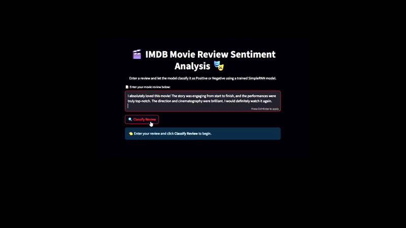

# 🎬 IMDB Movie Review Sentiment Analysis using SimpleRNN

Welcome to my deep learning project where I implement a **SimpleRNN-based sentiment classifier** using the IMDB dataset and deploy it via `Streamlit`. This project demonstrates end-to-end pipeline — from model training to web app deployment.

---

## 📊 **Dataset Details**

The project uses the IMDB Movie Reviews Dataset, which contains 50,000 highly polarized movie reviews labeled as positive or negative. This dataset is widely used for binary sentiment classification tasks.
- Source: Provided by TensorFlow/Keras datasets
- Data split: 25,000 reviews for training and 25,000 for testing
- Preprocessing: Reviews are tokenized into word indices with a vocabulary size limited to 10,000 most frequent words. Sequences are padded/truncated to a fixed length of 500 words for consistent input shape.

---

## Tools and Libraries
 
 
 
  

 
                                                                                                     

 

## 📽️ Demo Preview

## 🚀 **Project Highlights**

- [x] **Data Loading:** Loaded the IMDB dataset with a vocabulary size limited to ***10,000*** most frequent words.  
- [x] **Preprocessing:** Converted raw text reviews into sequences of integer word indices using the IMDB `word_index`, then *padded* or *truncated* all sequences to a fixed length of **500 tokens** to standardize input size.  
- [x] **Model Architecture:** Built a **SimpleRNN** model with:  
  - An **Embedding layer** (dimension = `128`)  
  - A **SimpleRNN layer** with `128` units and **ReLU** activation  
  - A **Dense output layer** with **sigmoid** activation for binary classification  
- [x] **Training:** Compiled the model with the **Adam optimizer** and **binary cross-entropy loss**, trained for **10 epochs** with batch size **32**, using **20% validation split**.  
- [x] **Model Saving:** Saved the trained model as an `.h5` file for easy reuse.  
- [x] **Prediction:** Created a separate notebook to load the saved model, preprocess new reviews, and generate sentiment predictions.  
- [x] **Deployment:** Developed an interactive **Streamlit** app to input movie reviews, preprocess text, run sentiment predictions in real time, and display results with a user-friendly interface.

